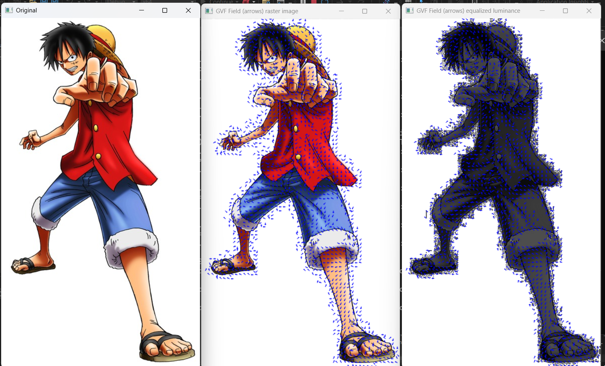
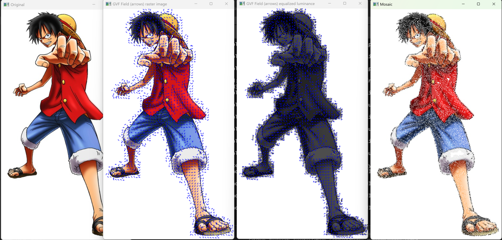
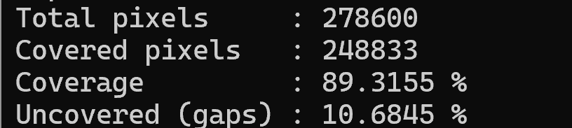

# GVF-Driven Artificial Mosaic

School project for CSS 587: an implementation of the “A Novel Artificial Mosaic Generation Technique” paper using OpenCV and C++.  
The program uses **Gradient Vector Flow (GVF)** computed on the equalized luminance image to guide the placement of small square tiles, producing an artificial mosaic.

---

## 1. Overview

Pipeline:

1. Load a color raster image.
2. Convert to luminance (grayscale) and apply histogram equalization.
3. Compute **Roberts gradients** on the equalized luminance image.
4. Run **Gradient Vector Flow (GVF)** iterations on the gradient field.
5. Compute the **GVF magnitude** and apply 3×3 non-maximum suppression.
6. Use a high threshold to select **seed points** and place tiles there.
7. Perform a second loop that scans the whole image and fills remaining regions with tiles.
8. Measure and print **coverage** (percentage of pixels covered by tiles).

The implementation closely follows the method in the original paper.

---

## 2. Results

### Gradient Vector Flow over raster and equalized luminance

### Mosaic generation

### Coverage statistics

The program prints coverage statistics for the test image, for example:

For the Luffy image shown above:

- **Total pixels:** 278,600  
- **Covered pixels:** 248,833  
- **Coverage:** ~89.3%  
- **Uncovered (gaps):** ~10.7%

---

## 3. Code layout

- `mosaic_main.cpp` – main program:
  - Roberts gradient computation  
  - GVF solver  
  - 3×3 non-maximum suppression  
  - Tile placement and mosaic rendering  
  - Coverage computation and display results
- `luffy.jpg` – example input image
- `GVF.png`, `Mosaic.png`, `coverage.png` – outputs of GVF, mosaic, and coverage table.

---

## 4. Building and running
Use openCV, C++, and VisualStudio to run like other assignments.

---

## 5. Demo video

The demo video (6–8 minutes) walks through:

- The input image
- GVF visualization on raster and equalized luminance
- Mosaic generation
- Coverage results

<video controls src="Project Presentation.mp4" title="Project Presentation"></video>

[Watch the demo](Project%20Presentation.mp4)

---

## 6. Reference

A Novel Artificial Mosaic Generation Technique Driven by Local Gradient Analysis

Sebastiano Battiato, Gianpiero Di Blasi, Giovanni Gallo, Giuseppe Claudio Guarnera, and Giovanni Puglisi

International Conference on Computational Science, 2008

